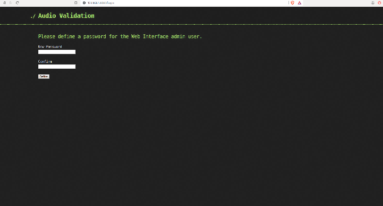
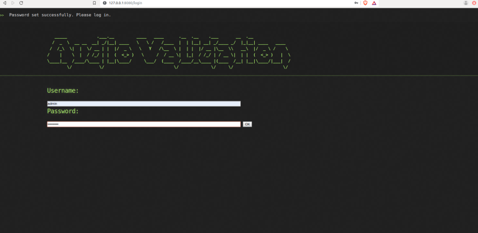
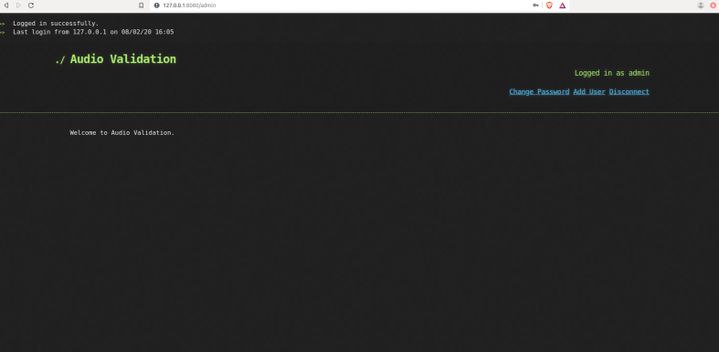
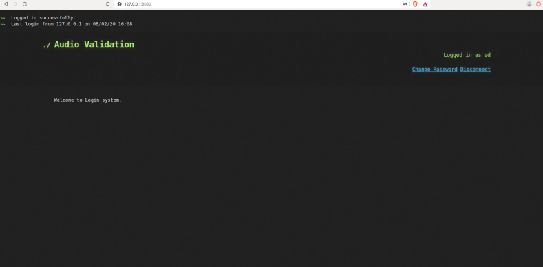
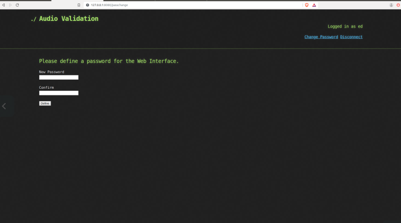
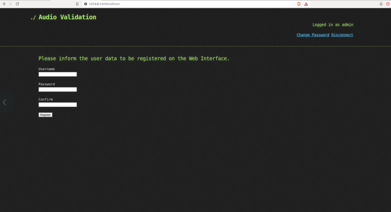

# Login System
 Flask + SQLAlchemy simple login/registration system. In the system there is the admin user who has permission to create users. Ordinary users cannot create users.


## Setup

Install the Python requirements:

```
python3 -m pip install -r requirements.txt
```

Initialize the database:

```
cd server
python3 app.py initdb
```

## Server

Run with the builtin (debug) server:

```
python3 app.py runserver -h 0.0.0.0 -p 8080 --threaded

```
The server should now be accessible on http://localhost:8080

## Images

### First Login - setting password for "admin" user


### Login Page


### Admin Home Page


### User Home Page


### Change Password Page


### Add New User Page

